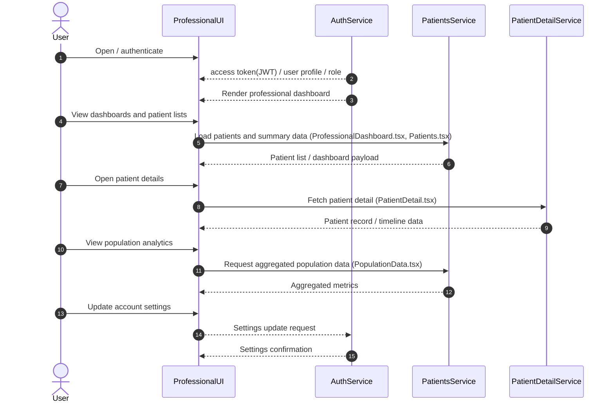
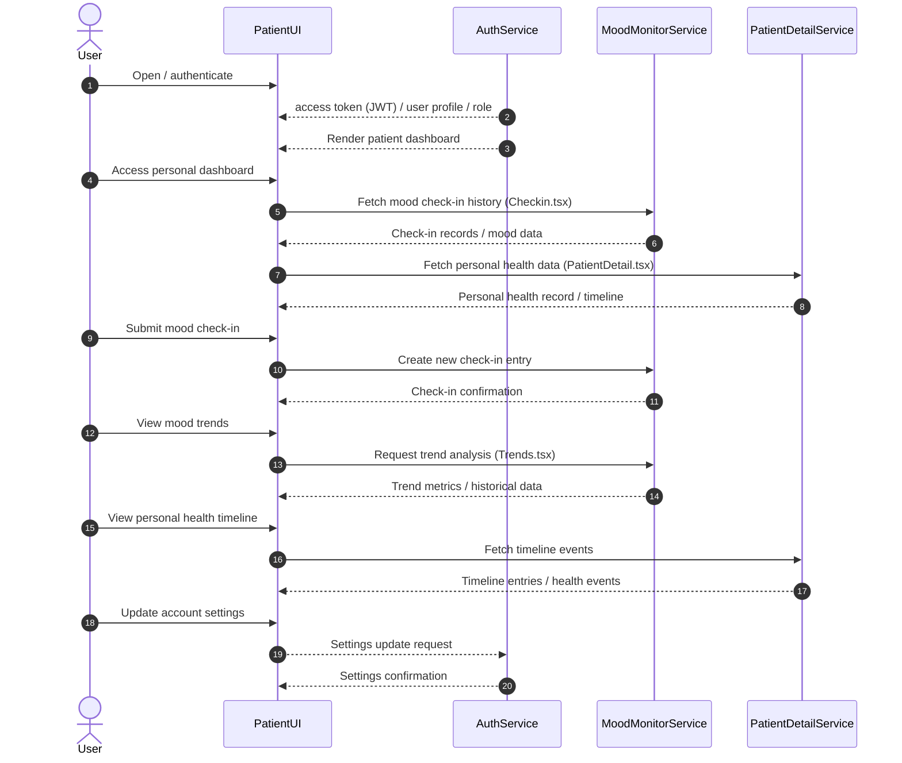

## Overview
The system is built to authorize users by using Role-Based Access Control. Hence, the functionalities are specific to the role of the user - Healthcare Professional or Patient.

## Healthcare Professional Interaction with the System

## Patient Interaction with the System

