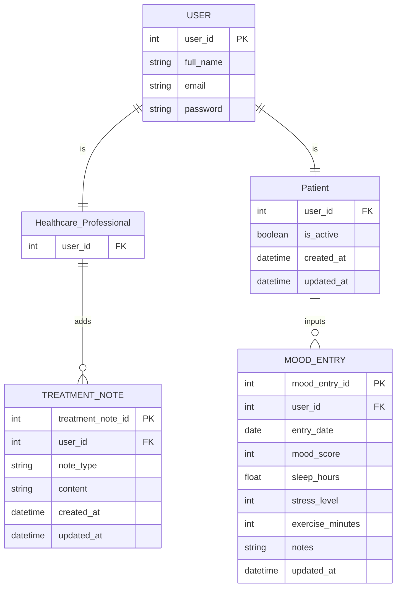

```mermaid
erDiagram

    USER {
        int user_id PK
        string full_name
        string email
        string password
    }

    Healthcare_Professional {
        int user_id FK
    }

    Patient {
        int user_id FK
        boolean is_active
        datetime created_at
        datetime updated_at
    }

    TREATMENT_NOTE {
        int treatment_note_id PK
        int user_id FK
        string note_type
        string content
        datetime created_at
        datetime updated_at
    }

    MOOD_ENTRY {
        int mood_entry_id PK
        int user_id FK
        date entry_date
        int mood_score
        float sleep_hours
        int stress_level
        int exercise_minutes
        string notes
        datetime updated_at
    }

    %% Relationships
    USER ||--|| Healthcare_Professional : "is"
    USER ||--|| Patient : "is"
    Healthcare_Professional ||--o{ TREATMENT_NOTE : "adds"
    Patient ||--o{ MOOD_ENTRY : "inputs"
```